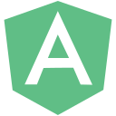
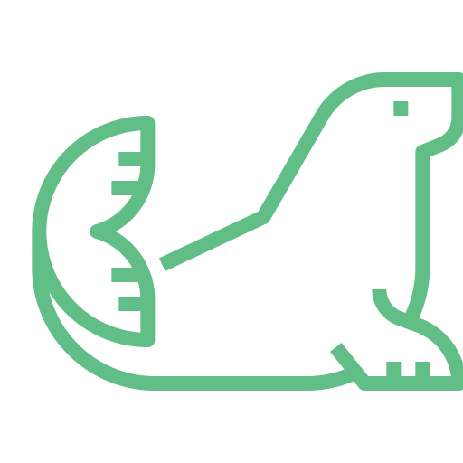
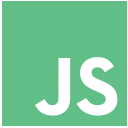
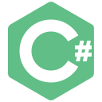
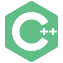

<header>

</header>

<h1 align="center">👋 Hi There</h1>
<h3 align="center">A passionate full-stack developer from Portugal</h3>

 
 

<h2>Contacts</h2>

    
    &nbsp;
    
    &nbsp;
    

 
 

<h2>Skills</h2>

<table align="center">
    <tr>
        <th>Skill</th>
        <th>Class.*</th>
        <th>Skill</th>
        <th>Class.*</th>
    </tr>
    <tr>
        <th colspan="2">Frontend Developer</th>
        <th colspan="2">Backend Developer</th>
    </tr>
    <tr>
        <td>
            
            ReactJS
        </td>
        <td align="right">8</td>
        <td>
            
            NodeJS
        </td>
        <td align="right">8</td>
    </tr>
    <tr>
        <td>
            
            AngularJS
        </td>
        <td align="right">8</td>
        <td>
             ExpressJS
        </td>
        <td align="right">8</td>
    </tr>
    <tr>
        <td>
             Angular/TypeScript</td>
        <td align="right">5</td>
        <td>
             MongoDB</td>
        <td align="right">7</td>
    </tr>
    <tr>
        <td>
             VueJS</td>
        <td align="right">4</td>
        <td>
             MariaDB</td>
        <td align="right">4</td>
    </tr>
    <tr>
        <td>
             JQuery</td>
        <td align="right">7</td>
        <td>
             Nginx</td>
        <td align="right">5</td>
    </tr>
    <tr>
        <td>
             HTML5</td>
        <td align="right">8</td>
        <td>
             Perl</td>
        <td align="right">6</td>
    </tr>
    <tr>
        <td>
             SCSS</td>
        <td align="right">8</td>
        <td colspan="2"></td>
    </tr>
    <tr>
        <td>
             Vanilla JavaScript</td>
        <td align="right">8</td>
        <th colspan="2">Mobile Developer</th>
    </tr>
    <tr>
        <td>
             PHP</td>
        <td align="right">3</td>
        <td>
             Flutter</td>
        <td align="right">7</td>
    </tr>
    <tr>
        <td>
             C#</td>
        <td align="right">3</td>
        <td>
             Java</td>
        <td align="right">7</td>
    </tr>
    <tr>
        <td>
             JSON</td>
        <td align="right">7</td>
        <td colspan="2"></td>
    </tr>
    <tr>
        <td colspan="2"></td>
        <th colspan="2">IoT Developer</th>
    </tr>
    <tr>
        <th colspan="2">Software Developer</th>
        <td>
             C/C++</td>
        <td align="right">6</td>
    </tr>
    <tr>
        <td>
             Visual Basic</td>
        <td align="right">5</td>
        <td>
             Python</td>
        <td align="right">5</td>
    </tr>
    <tr>
        <td colspan="4">
            

            

                * Personal classification, between 1 and 10, where 10 means that I feel very comfortable with the language/framework and where 1 means that I have already worked with it but without any deepening.
            

        </th>
    </tr>
</table>
