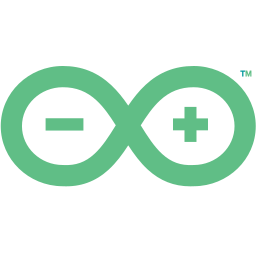

<h1 align="center">👋 Hi There</h1>
<h3 align="center">A passionate full-stack developer from Portugal</h3>

 
 

<h2>Contacts</h2>

    
    &nbsp;
    
    &nbsp;
    

 
 

<h2>Skills</h2>

<table align="center">
    <tr>
        <th>Skill</th>
        <th>Class.*</th>
        <th>Skill</th>
        <th>Class.*</th>
    </tr>
    <tr>
        <th colspan="2">Frontend Developer</th>
        <th colspan="2">Backend Developer</th>
    </tr>
    <tr>
        <td>
            
            &nbsp;
            ReactJS
        </td>
        <td align="right">8</td>
        <td>
            
            &nbsp;
            NodeJS
        </td>
        <td align="right">8</td>
    </tr>
    <tr>
        <td>
            
            &nbsp;
            AngularJS
        </td>
        <td align="right">8</td>
        <td>
            
            &nbsp;
            ExpressJS
        </td>
        <td align="right">8</td>
    </tr>
    <tr>
        <td>
            
            &nbsp;
            Angular/TypeScript
        </td>
        <td align="right">5</td>
        <td>
            
            &nbsp;
            MongoDB
        </td>
        <td align="right">7</td>
    </tr>
    <tr>
        <td>
             
            &nbsp;
            VueJS
        </td>
        <td align="right">4</td>
        <td>
            
            &nbsp;
            MariaDB
        </td>
        <td align="right">4</td>
    </tr>
    <tr>
        <td>
            
            &nbsp;
            JQuery
        </td>
        <td align="right">7</td>
        <td>
            
            &nbsp;
            Nginx
        </td>
        <td align="right">5</td>
    </tr>
    <tr>
        <td>
            
            &nbsp;
            HTML5
        </td>
        <td align="right">8</td>
        <td>
            
            &nbsp;
            Perl
        </td>
        <td align="right">6</td>
    </tr>
    <tr>
        <td>
            
            &nbsp;
            SCSS
        </td>
        <td align="right">8</td>
        <td colspan="2"></td>
    </tr>
    <tr>
        <td>
            
            &nbsp;
            Vanilla JavaScript
        </td>
        <td align="right">8</td>
        <th colspan="2">Mobile Developer</th>
    </tr>
    <tr>
        <td>
            
            &nbsp;
            PHP
        </td>
        <td align="right">3</td>
        <td>
            
            &nbsp;
            Flutter
        </td>
        <td align="right">7</td>
    </tr>
    <tr>
        <td>
            
            &nbsp;
            C#
        </td>
        <td align="right">3</td>
        <td>
            
            &nbsp;
            Java
        </td>
        <td align="right">7</td>
    </tr>
    <tr>
        <td>
            
            &nbsp;
            JSON
        </td>
        <td align="right">7</td>
        <td colspan="2"></td>
    </tr>
    <tr>
        <td colspan="2"></td>
        <th colspan="2">IoT Developer</th>
    </tr>
    <tr>
        <th colspan="2">Software Developer</th>
        <td>
            
            &nbsp;
            C/C++
        </td>
        <td align="right">6</td>
    </tr>
    <tr>
        <td>
            
            &nbsp;
            Visual Basic
        </td>
        <td align="right">5</td>
        <td>
            
            &nbsp;
            Python
        </td>
        <td align="right">5</td>
    </tr>
    <tr>
        <td colspan="4">
            

            

                * Personal classification, between 1 and 10, where 10 means that I feel very comfortable with the language/framework and where 1 means that I have already worked with it but without any deepening.
            

        </th>
    </tr>
</table>

 
 

<h2>Favourite tools</h2>

